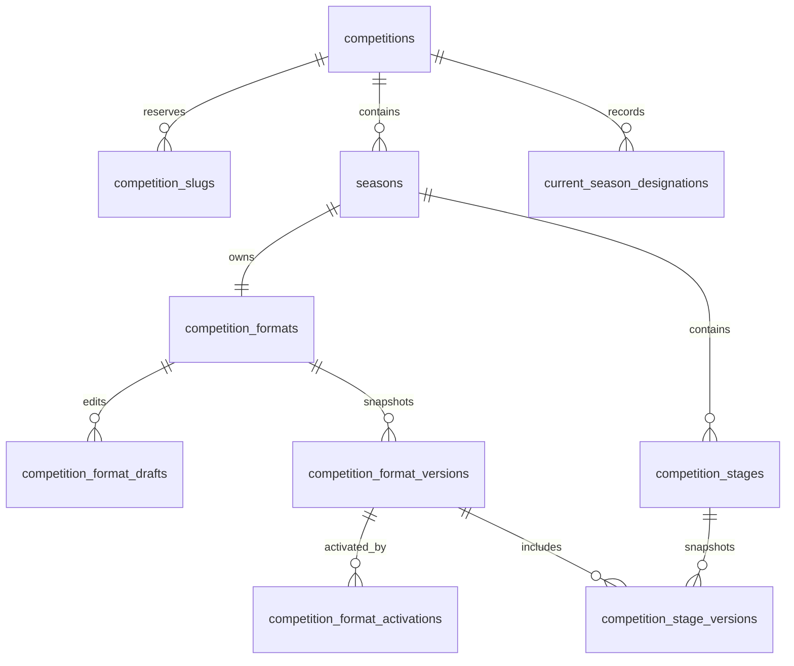
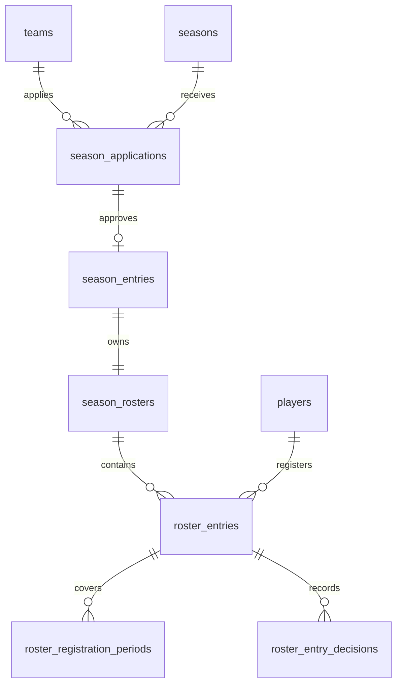
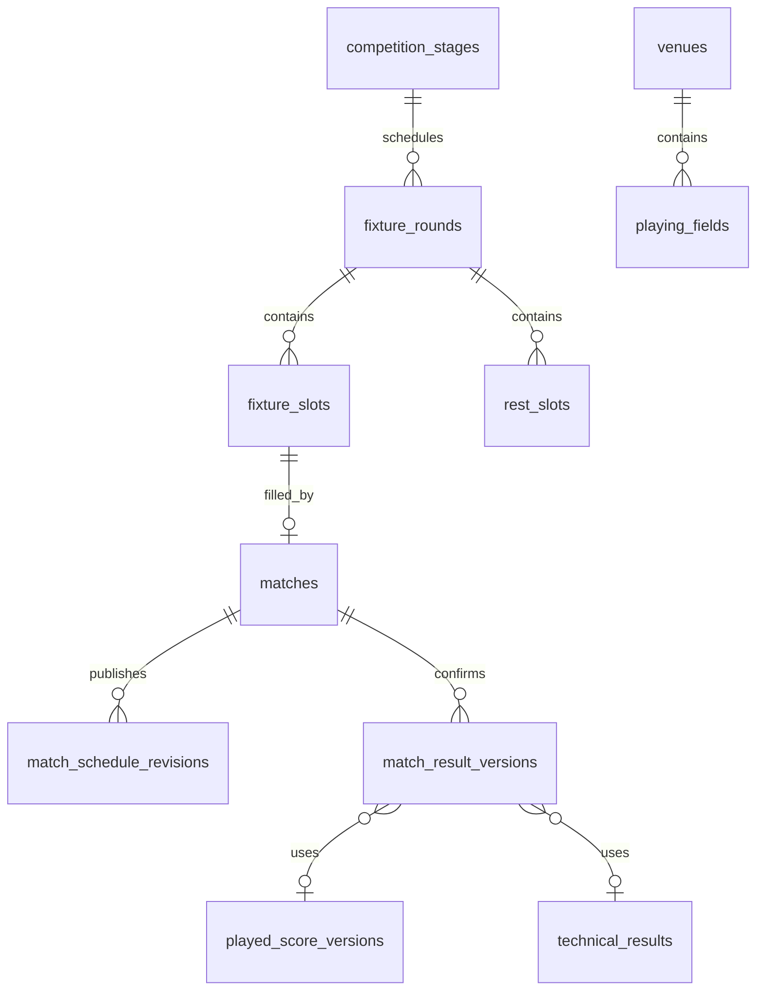

# ProLeague relational schema blueprint

## Status and purpose

This document is the implementation blueprint for the ProLeague MVP PostgreSQL schema. It translates the accepted domain language and ADR-0012 through ADR-0023 into relational ownership, history, constraint, access, retention, and indexing rules. It is not a Drizzle schema or a SQL migration.

The database uses one PostgreSQL application schema named `app`. Drizzle schema files will be partitioned by owning module, but all deployment changes belong to one reviewed SQL migration history.

## Global conventions

- Domain primary keys are application-generated UUIDv7 values. Ordered infrastructure records may additionally use a PostgreSQL-generated `bigint sequence_number`.
- Tables and columns use plural `snake_case`; primary keys are `id`, foreign keys end in `_id`, instants end in `_at`, and calendar dates end in `_on`.
- Mutable aggregate roots have `version bigint NOT NULL`, `created_at timestamptz NOT NULL`, and `updated_at timestamptz NOT NULL`. Repositories update `version` and `updated_at` explicitly in the same expected-version statement.
- Closed system states use `text` plus named `CHECK` constraints. Admin-managed classifications use reference tables.
- Instants are stored as UTC `timestamptz`. Birth and effective calendar dates use `date`. A partially known Scheduled Kickoff uses nullable local `date` and `time`, an IANA timezone, and a `timestamptz` only when both components are known.
- Roots store current pointers for efficient reads. Revisions, rulings, transitions, activations, decisions, and final snapshots are append-only.
- There is no generic `deleted_at`. Archive, withdraw, revoke, supersede, restrict, cancel, abandon, and remove are distinct domain states. Physical deletion is permitted only by the deletion matrix.
- Core identities, states, relationships, ordering, and progression are normalized. JSONB is limited to versioned Article content, redacted Audit changes, typed integration payloads, calculation traces, and format-template blueprints.
- Cross-module foreign keys use `ON DELETE RESTRICT` or `NO ACTION`; cross-module cascading deletion is prohibited.
- Every mutable aggregate is protected by optimistic concurrency. Important commands additionally use the command-execution registry.
- Public URLs never expose sequential identifiers. Article, Competition, Team, and Season slugs are retained in append-only per-entity slug tables so a former slug cannot be reused.
- Unicode display text and canonical normalized search/uniqueness values are stored separately. Normalization occurs in the application and is protected by database uniqueness.

## Table classifications

Every table belongs to exactly one operational classification:

| Classification | Mutation rule |
| --- | --- |
| Authoritative mutable root | Updated only by its owning repository with expected version |
| Immutable domain history | Insert-only; a later record supersedes or revokes an earlier record |
| Authoritative decision/output | Insert-only evidence used by current pointers and downstream decisions |
| Derived rebuildable projection | May be discarded and rebuilt; never accepted as domain truth |
| Operational queue/state | Mutable through bounded idempotent claim and retry workflows |
| Private evidence | Restricted access, explicit retention, and Legal Hold checks |
| Reference/configuration | Versioned when a change affects interpretation of Official information |

## Competition module

| Table | Class | Key contents and rules |
| --- | --- | --- |
| `competitions` | Mutable root | Names, description, presentation metadata, visibility/archive state, current Season pointer, current profile version, optimistic version |
| `competition_slugs` | Immutable history | Competition, display and normalized slug, valid-from time, replacement pointer; normalized slug unique across every current and former Competition slug |
| `competition_profile_versions` | Immutable history | Official/short name, description, logo reference and correction reason; Competition points to current version |
| `seasons` | Mutable root | Competition, name, scoped slug pointer, timezone, optional start/end dates, Sporting State, visibility, archive state, current Format Version and optimistic version |
| `season_slugs` | Immutable history | Season and Competition, display/normalized slug; unique by Competition and normalized slug across current and former values |
| `season_state_transitions` | Immutable history | From/to Sporting State, actor, reason, time and related ruling/amendment |
| `season_visibility_transitions` | Immutable history | Private/Public transitions independent of sporting state |
| `season_archive_transitions` | Immutable history | Archive/restore action, reason, actor and time |
| `current_season_designations` | Immutable decision | Competition, previous/new Season, actor, reason and effective time; selected Season must belong to Competition |
| `competition_formats` | Mutable root | One stable Format identity per Season and optimistic version |
| `competition_format_drafts` | Mutable root | One server-authoritative working blueprint per editing context, base immutable version, expected version and validation state |
| `format_draft_stages` | Mutable draft structure | Draft-local Stage identity, name, code, order, type and grouping mode |
| `format_draft_stage_groups` | Mutable draft structure | Draft-local Group identity, name, code and order |
| `format_draft_participant_slots` | Mutable draft structure | Draft-local Stage places and unresolved source definitions |
| `format_draft_dependencies` | Mutable draft structure | Draft-local progression edges and destinations |
| `format_draft_ranking_rule_sets`, `format_draft_points_schemes`, `format_draft_tie_breakers`, `format_draft_qualification_rules` | Mutable draft structure | Normalized points, ordered tie-breakers, fair-play, cross-group and qualification configuration |
| `format_draft_draw_pools`, `format_draft_draw_pots`, `format_draft_draw_constraints` | Mutable draft structure | Draft-local Draw Pools, optional Pots, constraints and qualification destinations |
| `format_draft_knockout_rounds`, `format_draft_knockout_ties`, `format_draft_tie_participant_slots`, `format_draft_resolution_steps` | Mutable draft structure | Draft-local Rounds, Ties, bracket destinations and ordered resolution steps |
| `competition_format_versions` | Immutable history | Complete normalized Format snapshot number, content hash, source Draft and creation metadata; the row never changes after insertion |
| `competition_format_activations` | Immutable decision | Season, activated Format Version, replaced activation/version, actor and effective time; Season current pointer is changed atomically |
| `format_amendments` | Mutable workflow root | Working state, base version, target Draft, applied version, reason, Supporting References, affected Stages and optimistic version |
| `format_amendment_transitions` | Immutable history | Prepare/validate/apply/reject transition, actor, reason, time and activated Format Version |
| `format_templates` | Mutable root | Reusable template identity, name, archive state and current template-version pointer |
| `format_template_versions` | Immutable history | Versioned JSONB blueprint with schema version, validation hash and author; contains no real Season Entries or Matches |
| `competition_stages` | Mutable root | Season, stable code, Sporting State, current Stage Version, current final snapshot pointers and optimistic version |
| `competition_stage_versions` | Immutable history | Format Version, Stage, name, order, `format_type` (`league`/`knockout`), league grouping mode and configuration hash |
| `stage_state_transitions` | Immutable history | Stage state changes, reason, actor, amendment/ruling reference and time |
| `stage_dependencies` | Immutable configuration | Source Stage/output and destination Stage/slot within one Format Version; graph cycles are rejected before activation |
| `stage_groups` | Mutable identity | Stable group identity within a Stage |
| `stage_group_versions` | Immutable history | Stage Version, group name, code and order; code/order unique within Stage Version |

An active Format is identified only by the Season current pointer and the append-only activation record. An immutable Format Version has no mutable `active` or `superseded` state.

## Registration module

| Table | Class | Key contents and rules |
| --- | --- | --- |
| `teams` | Mutable root | Current profile/slug pointers, locality, visibility/archive state and optimistic version |
| `team_profile_versions` | Immutable history | Official and short name, locality, logo and correction metadata |
| `team_slugs` | Immutable history | Display/normalized slug and replacement relation; every historical slug remains reserved |
| `players` | Mutable root | Current identity version, public-profile state, current photo, merge target and optimistic version |
| `player_identity_versions` | Immutable history | Given/family/patronymic/display names, normalized search values and correction metadata |
| `player_private_details` | Private evidence root | Current private-detail version pointer; excluded from public roles and views |
| `player_private_detail_versions` | Immutable private history | Exact date of birth, optional federation identifier, correction reason, actor and supersession relation |
| `player_merges` | Immutable decision | Retained/retired Player, reason, actor and time; retired roots point directly to the final retained Player |
| `player_publication_transitions` | Immutable history | Restricted/minimal/full state changes with reason and effective time |
| `player_publication_consents` | Private evidence | Minor Player, lawful basis/representative, scope, grant/expiry/revocation, Supporting Reference and audit metadata |
| `season_applications` | Mutable root | Season, Team, submitted date, current state/decision, checklist snapshot and optimistic version |
| `season_application_decisions` | Immutable decision | Recorded/review/approve/reject/withdraw/supersede actions with actor, reason and time |
| `application_checklist_templates` | Reference/configuration | Versioned checklist owned by a Season |
| `application_checklist_items` | Immutable application snapshot | Copied item label, required flag, review outcome, reviewer and exception reference |
| `season_entries` | Mutable root | Season, Team, approved Application, participation state and optimistic version; unique Season/Team and approved Application |
| `season_entry_state_transitions` | Immutable history | Register/suspend/reinstate/withdraw/disqualify history and reasons |
| `registration_windows` | Mutable root | Season, type, local date/time range, timezone, state and optimistic version |
| `registration_window_transitions` | Immutable history | Open/close/reopen/reschedule action, reason and actor |
| `roster_rule_sets` | Immutable configuration | Season, minimum/maximum size, readiness requirements and effective activation history |
| `legionnaire_quota_versions` | Immutable configuration | Base limit and at most one optional additional limit with birth-date cutoff |
| `season_rosters` | Mutable root | Season Entry, current Rule Set/readiness decision and optimistic version |
| `roster_readiness_decisions` | Immutable decision | Ready/not-ready result, exact input versions and blocking reasons |
| `roster_entries` | Mutable root | Roster, Player, state, playing position, classification/decision pointers and optimistic version |
| `roster_registration_periods` | Immutable history | Player, Season, Roster Entry and `[start,end)` effective `daterange` |
| `roster_entry_decisions` | Immutable decision | Submit/activate/reject/end actions, actor, reason and Supporting Reference |
| `legionnaire_classification_decisions` | Immutable decision | Local/Legionnaire, basis, actor, time and supersession relation |
| `roster_transfers` | Mutable workflow root | Source/destination Roster Entries, Player, Season, Transfer Window, effective date, state, reason and version |
| `roster_eligibility_rulings` | Immutable decision | Exact waived rule, period, reason, actor and Supporting Reference; other validations remain active |

Registration periods use a GiST exclusion constraint on Player, Season, and effective `daterange` so approved periods cannot overlap. Roster-size and quota counts are protected by ordered row locks and revalidation, not a row-level `CHECK`.

## Match module

| Table | Class | Key contents and rules |
| --- | --- | --- |
| `fixture_rounds` | Mutable structural root | Stage, stable code/order, source Format/Stage Version and optimistic version |
| `fixture_slots` | Mutable structural root | Stage, source version, slot type and optimistic version; exactly one specialization |
| `league_fixture_slots` | Authoritative configuration | Fixture Slot, Fixture Round and Home/Away participant sources |
| `knockout_fixture_slots` | Authoritative configuration | Fixture Slot, Tie and role (`single`, `first_leg`, `second_leg`, `replay`) |
| `playoff_fixture_slots` | Authoritative configuration | Fixture Slot and Ranking Tie Case |
| `replacement_fixture_slots` | Authoritative decision | Fixture Slot and original Suspended Match |
| `rest_slots` | Authoritative configuration | Fixture Round, Stage Participant Slot and structural order; it has no Match, Venue or score |
| `matches` | Mutable root | Fixture Slot, Stage, Sporting State, visibility, current participant/schedule/result/actual-kickoff pointers, immutable Calendar UID and optimistic version |
| `match_participant_assignments` | Immutable history | Match, Home/Away role, Season Entry, structural source, reason and supersession relation |
| `match_state_transitions` | Immutable history | From/to sporting state, cause reference, actor, reason and time |
| `match_visibility_transitions` | Immutable history | Private/Public transition and Publication Batch |
| `match_publication_batches` | Authoritative decision | One atomic publication unit, scope, actor, time and audit reference |
| `match_publication_batch_items` | Immutable decision | Batch, Match and exact Schedule Revision published |
| `match_schedule_drafts` | Mutable working state | Partially known date/time, timezone, Venue/Field, designation, expected duration/turnaround and expected version |
| `match_schedule_revisions` | Immutable history | Published schedule values, resolved UTC kickoff, Venue/Field FKs plus published name/address snapshots, reason and actor |
| `match_actual_kickoffs` | Immutable history | Actual UTC kickoff fact and correction chain; independent of Schedule Revision |
| `venues` | Mutable root | Current profile, locality/address/coordinates, visibility/archive state and optimistic version |
| `venue_profile_versions` | Immutable history | Name, locality, address, coordinates and correction reason |
| `playing_fields` | Mutable root | Venue, name/code, default duration/turnaround, default flag, archive state and optimistic version |
| `match_participant_occupancies` | Authoritative scheduling guard | Match, Season Entry and planned `tstzrange`; GiST exclusion blocks participant overlap |
| `match_result_drafts` | Mutable working state | Proposed played/technical inputs, shootout and disciplinary values before confirmation |
| `played_score_versions` | Immutable history | Regulation and optional extra-time goals, correction reason and supersession relation |
| `penalty_shootout_versions` | Immutable history | Successful kicks, winner, correction reason and supersession relation |
| `result_rulings` | Immutable decision | Assign/revise/revoke Technical Result, reason, date, actor, evidence and supersession relation |
| `technical_results` | Immutable decision payload | Exact Home/Away score created by an assign/revise Result Ruling |
| `match_result_versions` | Authoritative output | Exactly one Played Score or Technical Result, optional allowed Shootout, exact participant assignments and confirmation metadata |
| `disciplinary_summary_versions` | Immutable history | Match/Season Entry yellow, second-yellow and direct-red totals with correction chain |
| `match_replacements` | Immutable decision | Original and Replacement Match, ruling/reason, actor and current/superseded status |

Only a Finished Match has a current Official Match Result, and every Finished Match has one. A revoked Technical Result without a Played Score clears the current result and explicitly changes the Match state. Field occupancy is a warning that may be overridden with a reason; participant overlap is a hard exclusion.

## Standings and Progression module

| Table | Class | Key contents and rules |
| --- | --- | --- |
| `stage_participant_slots` | Authoritative configuration | Stable Stage place with code/order and expected source |
| `stage_participant_assignments` | Immutable history | Slot, Season Entry, source decision/output and current/superseded state; one current appearance per Entry/Stage |
| `ranking_rule_sets` | Immutable configuration | Stage Version and validation hash |
| `points_schemes` | Immutable configuration | Win/draw/loss values |
| `tie_breakers` | Immutable configuration | Rule Set, unique order and criterion type |
| `fair_play_weight_sets` | Immutable configuration | Yellow, second-yellow and direct-red weights |
| `cross_group_comparison_rules` | Immutable configuration | All matches, lowest-participant exclusion, or exact per-match ratio method |
| `qualification_rules` | Immutable configuration | Source positions/comparison and destination type; exactly one direct slot or Draw Pool FK |
| `qualification_slots` | Mutable stable identity | Named destination place in a Stage/Round/Tie |
| `qualification_outputs` | Authoritative output | Exact source final snapshot, destination, Season Entry/Bye and optional Qualification Ruling |
| `qualification_rulings` | Immutable decision | Ineligible calculated Entry and replacement/vacant/Bye outcome with evidence |
| `ranking_tie_cases` | Immutable calculation evidence | Tied Entries, criteria values, input versions, positions/boundary and calculation hash |
| `ranking_rulings` | Immutable decision | Tie Case, reason/evidence and supersession relation |
| `ranking_ruling_positions` | Immutable decision detail | Ruling, Season Entry and ordered position |
| `standing_adjustment_decisions` | Immutable decision | Signed points delta and apply/revoke/replace chain |
| `final_standings_snapshots` | Authoritative snapshot | Stage, Rule Set, finalization number, input hash, actor and supersession relation |
| `final_standings_rows` | Immutable snapshot detail | Position, Season Entry and exact calculated totals |
| `final_standings_evidence` | Immutable snapshot links | Exact result, disciplinary, adjustment, playoff and ruling versions |
| `draw_pools` | Authoritative configuration | Knockout Round, open/seeded mode and stable code |
| `draw_pool_entries` | Authoritative output | Pool, Season Entry/source Qualification Output and optional Pot |
| `draw_pots` | Authoritative configuration | Pool, code/order and constraints; open blind Draw has no Pots |
| `draw_constraints` | Immutable configuration | Allowed/prohibited pairing and Home/Away conditions |
| `knockout_rounds` | Mutable root | Stable Round identity and current version |
| `knockout_round_versions` | Immutable configuration | Stage Version, order, bracket mode and Rule Set |
| `tie_resolution_rule_sets` | Immutable configuration | One/two-match format and validation hash |
| `tie_resolution_steps` | Immutable configuration | Ordered supported steps: regulation/aggregate, optional extra time/replay, penalties |
| `knockout_ties` | Mutable root | Stable Tie identity, lifecycle, current version/ruling/outcome and optimistic version |
| `knockout_tie_versions` | Immutable configuration | Round Version, bracket position, two participant slots and destination rules |
| `knockout_tie_participant_slots` | Authoritative configuration | Stable Home/Away place in a Tie, expected source and current assignment; target of Draw Outcome assignments |
| `tie_state_transitions` | Immutable history | Configured/ready/in-progress/awaiting/finalized/suspended transitions |
| `draw_outcome_drafts` | Mutable working state | Round, external draw date, assignments, evidence, validation state and optimistic version before publication |
| `draw_outcomes` | Immutable decision | Published Round result, date, actor, evidence, content hash and superseded outcome |
| `draw_outcome_assignments` | Immutable decision detail | Pool Entry or unresolved source assigned to one Tie participant slot/Home-Away position |
| `confirmed_byes` | Immutable decision | Source directly fills destination without Tie or Match |
| `tie_rulings` | Immutable decision | Winner without Match score, reason/evidence and supersession/revocation chain |
| `tie_outcomes` | Authoritative output | Exact Result/Shootout/Ruling inputs, aggregate, winner and Rule Set Version |
| `placement_outputs` | Authoritative output | Champion/Runner-up/Third/Fourth from exact Finalized Tie Outcome |
| `final_knockout_snapshots` | Authoritative snapshot | Complete finalization header, input hash and supersession relation |
| `final_knockout_evidence` | Immutable snapshot links | Exact Ties, outcomes, draws, byes, rulings and placements |

Provisional Standings, Aggregate Score, and unresolved progression are derived on demand. Optional projection tables are rebuildable and may never be referenced as finalization evidence.

## Editorial and Media modules

| Table | Owner/class | Key contents and rules |
| --- | --- | --- |
| `news_articles` | Editorial / mutable root | Lifecycle, current Working Copy/Published Revision/current slug pointers, immutable first-publication time and optimistic version |
| `article_slugs` | Editorial / immutable history | Display/normalized slug and redirect chain; every old slug remains reserved |
| `article_working_copies` | Editorial / mutable working state | Title, summary, body JSONB/schema version, SEO data, selected Category, recovery version and validation state |
| `article_revisions` | Editorial / immutable history | Complete publication snapshot, Category and label snapshot, correction metadata, content hash and supersession relation |
| `article_state_transitions` | Editorial / immutable history | Draft/Scheduled/Published/Archived transitions and exact schedule/revision cause |
| `article_categories` | Editorial / mutable root | Current name/slug/archive state and optimistic version |
| `article_category_versions` | Editorial / immutable history | Name/slug changes and reasons |
| `article_category_state_transitions` | Editorial / immutable history | Archive/restore actions |
| `article_*_associations_working` | Editorial / mutable working state | Explicit Competition, Season, Team, Match and Player links |
| `article_*_associations_revision` | Editorial / immutable history | The same associations copied for one Published Revision |
| `article_publication_schedules` | Editorial / mutable workflow | Due time, working version, state, attempts and optimistic version |
| `article_recovery_snapshots` | Editorial / temporary history | Bounded server recovery JSONB; never Official information |
| `featured_article_decisions` | Editorial / immutable decision | Feature/unfeature period and supersession history |
| `media_upload_intents` | Media / operational state | Expected upload metadata, temporary key, expiry and idempotency key |
| `media_assets` | Media / mutable root | Immutable original identity/checksum/key, processing/withdrawal state, current metadata/presentation and optimistic version |
| `media_asset_metadata_versions` | Media / immutable history | Source, creator, rights, default accessibility metadata and correction reason |
| `media_presentations` | Media / immutable history | Focal point/transformation version and readiness |
| `media_asset_variants` | Media / immutable file metadata | Presentation, purpose, format, dimensions, checksum, key and processing state |
| `media_processing_attempts` | Media / operational state | Processor version, attempt, sanitized error and completion metadata |
| `article_media_placements_working` | Editorial / mutable working state | Cover/inline role, Media presentation, contextual alt/caption/decorative flag and order |
| `article_media_placements_revision` | Editorial / immutable history | Exact placement, presentation, accessibility and attribution snapshot for Published Revision |
| `media_asset_state_transitions` | Media / immutable history | Processing/active/failed/withdrawn/restored transitions |
| `media_withdrawal_decisions` | Media / immutable decision | Withdraw/restore, reason/evidence, actor and Urgent Purge state |
| `media_storage_tombstones` | Media / operational evidence | Deleted object/variant checksum and key hash, reason, confirmation and restore-reconciliation state |

Embedded YouTube references remain validated nodes inside the Article Content Document. Arbitrary HTML and iframe source are never stored.

## Identity and Access module

| Table | Class | Key contents and rules |
| --- | --- | --- |
| `admin_identities` | Mutable root | Display name, current contact email, lifecycle metadata and optimistic version |
| `admin_external_identities` | Authoritative mapping | Provider, unique Clerk user ID, Admin Identity and synchronization timestamps |
| `admin_invitations` | Mutable root | Normalized email, Clerk invitation ID, inviter, expiry, state, resend metadata and version |
| `admin_access_grants` | Mutable root | Admin Identity, source invitation/bootstrap, state, effective period and optimistic version |
| `admin_access_state_transitions` | Immutable history | Invited/active/suspended/revoked transition, reason and synchronization state |
| `admin_sessions` | Operational security state | Opaque/hashed Clerk session ID, grant, start/last-seen/provider expiry and revocation state |
| `external_identity_events` | Integration inbox detail | Verified Clerk event, subject, occurrence time, sanitized fields and processing outcome |
| `external_sync_operations` | Mutable reconciliation state | Requested local version, deterministic key, provider reference, retries and outcome |
| `reconciliation_items` | Mutable workflow | Missing federation context, affected record, explanation and resolution state |
| `privileged_operation_records` | Private immutable evidence | Bootstrap/Break-glass operator snapshot, reason, evidence, outcome and reconciliation |

The last-Active-Admin rule is enforced by an ordered lock and transaction-time count. No password, session token, factor secret, or recovery code enters PostgreSQL. A future stronger-authentication plan may add synchronized readiness metadata only after the production Security Review; credential material remains provider-owned.

## Governance module

| Table | Class | Key contents and rules |
| --- | --- | --- |
| `audit_events` | Immutable history | UUID, global sequence, actor snapshot, action, outcome, UTC time, reason, source, correlation and command keys |
| `audit_event_targets` | Immutable history | Primary/related/affected typed target, UUID/version and display snapshot |
| `audit_event_changes` | Immutable history | Redacted schema-versioned JSONB diff or immutable revision reference |
| `security_event_contexts` | Temporary private evidence | Audit Event, session/network/client context and 90-day expiry |
| `supporting_references` | Reference/private evidence | External URL, Private Document, external identifier or text reference |
| `private_documents` | Private evidence root | Logical file, owner module, access classification, current version and retention deadline |
| `private_document_versions` | Immutable private evidence | Object key, checksum, MIME, size, uploader and replacement relation |
| `private_document_upload_intents` | Operational private state | Expiring verified upload intent distinct from public Media upload |
| `privacy_requests` | Mutable workflow root | Requester contact, due dates, current state/outcome and optimistic version |
| `privacy_request_transitions` | Immutable history | Received/review/resolution transitions and reasons |
| `privacy_request_items` | Private workflow detail | Affected subjects/resources and requested scope |
| `privacy_request_actions` | Authoritative decision/action | Correct/restrict/anonymize/delete/preserve/purge step and completion evidence |
| `legal_holds` | Mutable root | Reason, active/released state, actor and optimistic version |
| `legal_hold_targets` | Authoritative decision detail | Direct or enclosing-scope typed target |
| `retention_policies` | Immutable configuration | Resource type, trigger, duration, action, effective time and approval |
| `retention_candidates` | Operational state | Policy/target, hold/reference checks, review state and execution result |
| `privacy_deletion_ledger` | Permanent restricted evidence | Opaque/keyed target hash, action, request, time and restore reapplication marker; never deleted personal fields |

The application role can insert and select Audit History but cannot update, delete, or truncate it. Database grants and a protective trigger enforce append-only behavior.

## Operations module and integration infrastructure

| Table | Class | Key contents and rules |
| --- | --- | --- |
| `outbox_messages` | Operational queue | Typed/schema-versioned payload, aggregate version, correlation/causation, availability, lease, attempts and outcome |
| `command_executions` | Operational idempotency | Actor scope, key, payload hash, safe result reference, state and expiry |
| `scheduled_jobs` | Operational queue | Deterministic logical job key, target/version, due time, lease, state and retries |
| `job_runs` | Operational history | One attempt, timing, sanitized error and outcome |
| `cache_invalidation_intents` | Operational state | Semantic target, committed version, ordinary/urgent level and confirmation state |
| `inbound_webhook_receipts` | Integration inbox | Source/event ID, signature result, payload hash/sanitized payload and processing state |
| `notification_deliveries` | Operational state | Template/version, recipient class/address where required, deterministic key and provider outcome |
| `incident_records` | Mutable root | Severity/state, ownership, timeline, impact, affected classification and postmortem reference |
| `incident_state_transitions` | Immutable history | State, actor and time |
| `operational_alerts` | Mutable workflow | Severity, source, acknowledgement, resolution and Incident link |
| `recovery_verifications` | Immutable operational evidence | Backup reference, RPO/RTO measurements, integrity checks, operator and outcome |
| `restore_validations` | Immutable decision | Admin validation of restored results, standings, applications, publications and cache state |

Workers claim queue rows in bounded batches with `FOR UPDATE SKIP LOCKED`, commit the lease before external work, and use deterministic idempotency keys. Processed outbox rows may be deleted after 30 days; permanent evidence remains in domain and Audit records.

## Critical constraint matrix

| Invariant | Database mechanism | Additional application mechanism |
| --- | --- | --- |
| One Current Season per Competition and correct ownership | Current pointer plus composite FK | Competition lock and expected version |
| One immutable active Format selection | Season pointer and activation uniqueness | Validate complete snapshot; atomic activation/amendment |
| Immutable histories and snapshots | Grants/trigger prohibit update/delete | No repository update methods |
| Unique Stage/group/round/slot order and codes | Composite unique constraints | Full graph validation |
| A Qualification Rule has one destination | `CHECK` XOR direct-slot/Draw-Pool FK | Validate source/destination compatibility |
| No duplicate current participant in one Stage/Round | Partial unique indexes | Validate unresolved source convergence |
| Valid Tie resolution sequence | Unique step order and allowed-type checks | Validate supported whole sequence |
| One Match per Fixture Slot | Unique Match `fixture_slot_id` | Draft/removal rules |
| Exactly one Fixture Slot specialization | Deferrable constraint trigger | Owning command creates slot atomically |
| No participant schedule overlap | GiST exclusion on occupancy range | Rebuild occupancy with Schedule Revision transaction |
| Field overlap is overrideable | Supporting indexes only | Locked validation and reasoned override |
| Finished iff current Official Result exists | Named consistency constraint/constraint trigger | State transition command |
| Official Result has one source | XOR `CHECK` Played/Technical FK | Rule compatibility validation |
| Shootout only on played decisive result | FK and source `CHECK` | Tie Resolution validation |
| Non-negative scores/card totals | Named `CHECK` constraints | Winner/rule validation |
| No overlapping Player registration in a Season | GiST exclusion on Player/Season/date range | Ordered Player/Roster locks |
| One Season Entry per Team/Season | Composite unique constraint | Application approval transaction |
| Roster limits and Legionnaire quota | FK/check/range constraints | Ordered lock, count and rule revalidation |
| One non-revoked Grant per Admin Identity | Partial unique index | Last-Active-Admin transaction |
| No duplicate logical command/job/webhook | Scoped unique idempotency keys | Payload-hash comparison and safe replay |
| Published revision is reproducible | Root current pointer to immutable revision | Atomic publication/audit/outbox transaction |
| Former slug never reused | Unique normalized slug in per-entity slug history | Canonical redirect resolution |
| Legal Hold blocks deletion | FK/indexes on active targets | Mandatory pre-delete scope check |

## Index matrix

All deletion-check and frequently joined foreign keys receive explicit indexes. Initial query indexes include:

- Articles by lifecycle/publication time, category, feature period, current slug, and scheduled due time.
- Competitions and Teams by current and historical normalized slug; Seasons by Competition, visibility, state, archive, and scoped slug.
- Matches by Season/Stage, visibility/state, Scheduled Kickoff, Fixture Round, participant, Venue/Field, and Calendar UID.
- Current Roster Entries by Season/Roster/Player/state; GiST registration-period exclusion; application/window state and due-time indexes.
- Current Stage participants, Qualification destinations, Draw Pool entries, Tie/Round order, current outcomes, and final snapshot pointers.
- Audit Events by sequence/time, actor, action, outcome, and target; security context expiry.
- Pending outbox/jobs/webhooks by state and availability; open reconciliation/alerts/privacy requests; active Legal Holds and retention candidates.
- Media by state, checksum, withdrawal, variant readiness, and orphan-retention deadline.

Indexes for speculative filters are deferred until Query Layer contracts or measured production plans justify them. MVP tables are not partitioned and provisional projections are not materialized views.

## Access and PII matrix

| Role | Access |
| --- | --- |
| `app_migrator` | Version-controlled DDL during a locked release only |
| `app_runtime` | Owning Admin transactions; no Audit update/delete; private access only through authorized repositories |
| `app_public_reader` | Read-only public views for Published Articles, Public Competitions/Seasons/Teams/Matches, permitted Player profiles, and active Media metadata |
| `app_worker` | Required queues, scheduled workflows, integrations and narrowly scoped domain commands |
| `app_drift_reader` | Schema metadata/dump inspection without personal-row access |

Technical payloads use stable IDs rather than personal records. Raw webhook payloads are not retained by default; stored content is sanitized and hashed. Command outcomes exclude exact birth dates, documents, and secrets. Notification recipient addresses appear only where delivery requires them and expire under the operational retention policy.

## Deletion, retention, and anonymization matrix

| Record | Rule |
| --- | --- |
| Published sporting/editorial history, rulings, final snapshots and Audit History | Permanent; supersede/archive/restrict rather than delete |
| Never-published Draft and its exclusively owned children | Physical deletion permitted after dependency and Legal Hold checks |
| Unpublished, unstarted, dependency-free Private Match | Physical deletion permitted; published Calendar UID is never reused |
| Never-published orphaned Media | Delete after 30 days; record storage tombstones |
| Published or withdrawn Media | Preserve metadata/history; purge public binary when ruled; restore only through a new decision |
| Supporting application/eligibility documents | Delete three years after Season unless Hold/policy requires otherwise |
| Private Player registration data | Review after last participation plus five years; preserve only justified Official history |
| Privacy Requests | Retain five years with private access |
| Security event context | Delete after 90 days; base Audit Event remains |
| Processed outbox and ordinary idempotency rows | Normally delete after 30 days once permanent evidence exists |
| Application logs | Outside domain schema; retain 30 days |

Player privacy actions remove unnecessary private data, restrict public presentation, and withdraw media while preserving justified sporting identity. If full identity can no longer be retained, a new pseudonymous identity version replaces current display data; the deletion ledger stores only opaque identifiers/hashes needed to reapply the outcome after restore.

## Migration and verification consequences

The first implementation migration must create the complete schema from an empty supported PostgreSQL database. Implementation tickets may split the physical creation by coherent module phases, but the resulting constraints and ownership cannot be weakened.

Acceptance tests must cover clean installation, prior-release upgrade, immutable-table protection, public-role denial of private data, every critical unique/check/exclusion constraint, current-pointer ownership, optimistic conflicts, lock ordering, rollback with Audit failure, idempotent job claims, deletion under Legal Hold, and reconstruction of every final snapshot from its recorded input versions.
